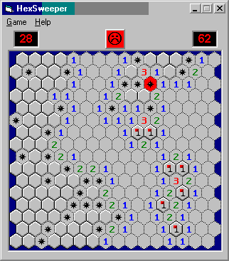



## Minesweeper Hexagonal

### Description

This is a new twist on Minesweeper with its hexagonal tiles. Uses recursive subrutine to clear out open area and transperant BitBlt to draw the tiles.
 
### More Info
 

             |
---                |---
**Submitted On**   |2003-04-30 11:15:44
**By**             |[Paul Bahlawan](https://github.com/Planet-Source-Code/PSCIndex/blob/master/ByAuthor/paul-bahlawan.md)
**Level**          |Intermediate
**User Rating**    |5.0 (20 globes from 4 users)
**Compatibility**  |VB 6\.0
**Category**       |[Games](https://github.com/Planet-Source-Code/PSCIndex/blob/master/ByCategory/games__1-38.md)
**World**          |[Visual Basic](https://github.com/Planet-Source-Code/PSCIndex/blob/master/ByWorld/visual-basic.md)
**Archive File**   |[Minesweepe1581154302003\.zip](https://github.com/Planet-Source-Code/paul-bahlawan-minesweeper-hexagonal__1-45136/archive/master.zip)

